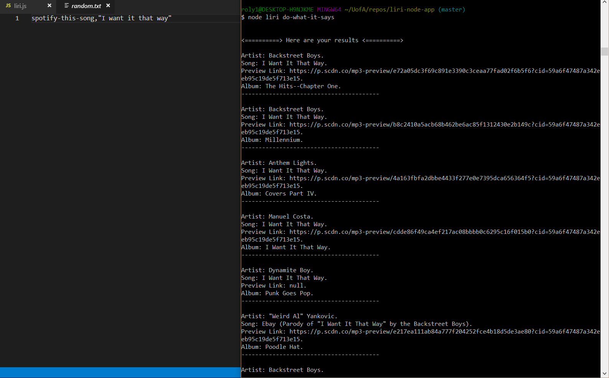

# **liri-node-app**

Liri app allows you to search for concert/song/movie data using various API's in a CLI node app.

After entering a valid CLI argument and search team the app will return the requested information as shown below.

------
## **concert-this**

concert-this will call the bandsintown API and return information of the search query which should be an artist/band name.

If the user does not enter an artist the app will show the default menu, otherwise the app will return all concert dates listed on bandintown for the artist.

------
## **spotify-this-song**

spotify-this-song will call the spotify API and return information of the search query which should be a song title.

If no input is given when calling "spotify-this-song" the app will default to searching for "The Sign" by Ace of Base.

Otherwise the searched for song will be returned.

------
## **movie-this**

movie-this will call the omdb API and return information of the search query which should be a movie title.

If no input is given when calling "movie-this" the app will default to searching for the movie "Mr. Nobody", and return its information.

------
## **do-what-it-says**

The do-what-it-says option of the app will go out and read the information within random.txt and call the specified app functionality and the search term inputed in the following format: spotify-this-song,"I want it that way"

